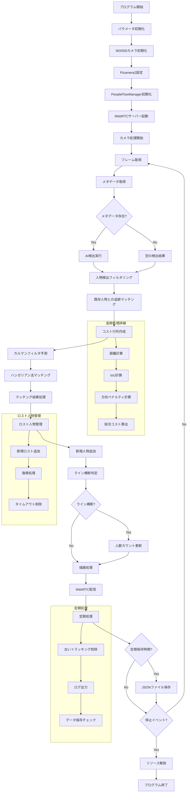

# Raspberry Pi での人流カウントシステム

## 概要

本システムは、Raspberry Pi とIMX500 AIカメラモジュールを使用した人流カウントシステムです。ここでは人の移動方向を検出してカウントします。cronによるスケジュール運用機能についても記載します。

## 機能

- IMX500 AIカメラモジュールによる人物検出
- 指定ラインを横切る人の方向別カウント
- JSONファイルへのカウントデータ保存
- ヘッドレス環境でも実行可能

## 必要条件

- Raspberry Pi（3B+以上推奨）
- IMX500 AIカメラモジュール
- Raspberry Pi OS（Bullseye以降）

## セットアップ手順

### 1. システム準備

```bash
# システムアップデート
sudo apt update
sudo apt upgrade -y
```

# 必要なシステムパッケージのインストール

```bash
sudo apt install -y python3-pip python3-venv git cmake build-essential \
    libatlas-base-dev libhdf5-dev libhdf5-serial-dev libjpeg-dev \
    libopenjp2-7-dev python3-picamera2 imx500-all
```
#### GUIもインストールしたラズパイの場合はシステム版opencvを使用する
```bash
sudo apt install python3-opencv
```

### 2. Python環境構築

#### 仮想環境の作成と有効化
```bash
python3 -m venv venv --system-site-packages
source venv/bin/activate
```

#### パッケージのインストール
```bash
pip install --upgrade pip wheel setuptools
pip install -r requirements.txt
```
#### GUIをインストールしてない場合はpip版opencvを使用する
```bash
pip install opencv-python
```

### 3. IMX500モデルの確認

```bash
# モデルファイルの確認
ls -la /usr/share/imx500-models/
```

### 4. 設定ファイルの準備

```bash
# 設定ファイルを作成する
vim config.json

{
  "COUNT_DIRECTION": "BOTH",
  "DETECTION_THRESHOLD": 0.55,
  "MIN_BOX_HEIGHT_PX": 50,
  "MAX_BOX_HEIGHT_PX": 400,
  "IOU_THRESHOLD": 0.45,
  "MAX_DETECTIONS": 50,
  "CENTER_LINE_MARGIN_PX": 100,
  "RECOVERY_DISTANCE_PX": 150,
  "TRACKING_TIMEOUT": 0.25,
  "ACTIVE_TIMEOUT": 2.0,
  "DISTANCE_COST_NORMALIZE_PX": 100,
  "DIRECTION_STABILITY_MARGIN_PX": 15,
  "DIRECTION_MISMATCH_PENALTY": 0.8,
  "MAX_ACCEPTABLE_COST": 1.5,
  "COUNT_DATA_OUTPUT_INTERVAL": 60,
  "COUNT_DATA_OUTPUT_DIR": "people-count-data",
  "STATUS_UPDATE_INTERVAL": 15,
  "MOVEMENT_WINDOW": 30,
  "MOVEMENT_THRESHOLD": 5.0,
  "TRAJECTORY_MAX_LENGTH": 60
}
```

#### 各種パラメータについて

| パラメータ名 | 単位 | 概要・説明 | 設定値・推奨値・調整指針 |
|-------------|------|-----------|----------------------|
| `COUNT_DIRECTION` | - | カウント対象となる人物の移動方向を指定する | `"LEFT_TO_RIGHT"`: 左→右 のみカウント<br>`"RIGHT_TO_LEFT"`: 右→左 のみカウント<br>`"BOTH"`: 両方向をカウント |
| `IOU_THRESHOLD` | - | NMS（Non-Maximum Suppression, 非最大抑制）における「バウンディングボックス間の重なり（IoU）」の上限値 | 推奨値: 0.3～0.6<br>対象物・カメラ精度・用途に応じて調整 <br> **大きい値**：大きく重なった場合のみ除外→重複ボックスが残りやすい<br>**小さい値**：少しの重なりでも除外→重複ボックスが減る |
| `MAX_DETECTIONS` | 個 | 1フレームで取り扱う検出結果の最大数<br>超過した分は間引きまたは無視する | 混雑状況（同時検出人数）やリソースにあわせ調整<br>多すぎ：計算負荷・誤追跡リスク増<br>少なすぎ：見逃しリスク |
| `DETECTION_THRESHOLD` | - | 検出器が出力する「検出信頼度スコア」の下限値<br>これ未満は無視する | 推奨値: 0.4～0.7（モデル・ノイズ環境により調整し、F1スコアが最大化される値を選定） <br> 値を**上げる**：誤検出（偽陽性）は減るが、見落とし（偽陰性）は増える傾向<br>値を**下げる**：検出感度は上がるが、誤検出も増える |
| `MIN_BOX_HEIGHT_PX` | px | 許容する人物検出ボックス最小高さ<br>これより小さいBoxは排除 | 映像に人物Boxの大きさを記載しているのでそれを参照するとよい<br>制限しない場合はとにかく大きい値(680など)を指定して下さい |
| `MAX_BOX_HEIGHT_PX` | px | 許容する人物検出ボックス最大高さ<br>これより大きいBoxは排除 | 映像に人物Boxの大きさを記載しているのでそれを参照するとよい<br>制限しない場合は0を指定して下さい |
| `CENTER_LINE_MARGIN_PX` | px | ライン近傍とする絶対値距離 |  広い：誤判定増<br>狭い：本来対象となる人の見逃し増<br>すれ違う時に見切れる範囲(人物の横幅の大きさ)を鑑みて指定する |
| `RECOVERY_DISTANCE_PX` | px | 復帰条件の上限距離<br>CENTER_LINE_MARGIN_PX内で見失った過去の人物と新規検出の中心座標（x）がこの距離以内なら「同一人物が復帰」とみなす | 大きい：誤復帰（異なる人物を繋ぐ）リスク<br>小さい：復帰し損なうリスク<br>`CENTER_LINE_MARGIN_PX`の1.5倍から2倍くらいで調整|
| `TRACKING_TIMEOUT` | 秒 | active_peopleのうち、最後に認識してから追跡をやめるまでの時間 | 1秒未満で問題ないです |
| `ACTIVE_TIMEOUT` | 秒 | CENTER_LINE_MARGIN_PX内で見失った人物の保持猶予時間<br>人物被りなどで見失っても再度検出し復帰する可能性を期待し続け、この間復帰を試行する | `CENTER_LINE_MARGIN_PX`通り抜け切る時間くらいが良さそう |
| `DISTANCE_COST_NORMALIZE_PX` | px | 距離正規化用<br>距離をこの値で割った値をコストとして付加する | `DIRECTION_STABILITY_MARGIN_PX`よりは大きくする |
| `DIRECTION_STABILITY_MARGIN_PX` | px | 検出座標の揺れ、ノイズの許容範囲<br>この範囲内の座標変動は"逆方向マッチ時の追加コスト"を与えず許容する | 認識する人物の大きさを鑑みて指定する|
| `DIRECTION_MISMATCH_PENALTY` | px | 逆方向マッチ時の追加コスト<br>急な方向転換は基本的には想定されないため、進行方向との逆方向をマッチ候補にしたときはペナルティとして追加でコストを付与する | `MAX_ACCEPTABLE_COST`よりは小さくする |
| `MAX_ACCEPTABLE_COST` | - | 最大許容コスト<br>この値よりコストが大きくなった場合、無効なマッチとして処理 | 1.0以上2.0以下でいいかな<br>厳しすぎると全然追跡できなくなる |
| `COUNT_DATA_OUTPUT_INTERVAL` | 秒 | カウントデータ(JSONファイル)を出力して保存する間隔 | 分析時のカウント単位<br>60秒なら「1分あたりの通過人数」<br>3600秒 (=1時間) なら「1時間あたりの通過人数」として集計される |
| `COUNT_DATA_OUTPUT_DIR` | - | 出力されたカウントデータ(JSONファイル)の保存ディレクトリ名 | "people-count-data"とか |
| `STATUS_UPDATE_INTERVAL` | 秒 | 定期ログ出力間隔 | 0または負値で無効 |
| `MOVEMENT_WINDOW` | フレーム | 移動方向判定用の直近フレーム数<br>人物の移動方向を安定して判定するために使用する過去のフレーム数 | 推奨値: 20～50<br>**大きい値**：より安定した方向判定が可能だが、方向転換への反応が遅くなる<br>**小さい値**：方向転換に素早く反応するが、ノイズの影響を受けやすい |
| `MOVEMENT_THRESHOLD` | px/フレーム | 明確な移動と判定する最小移動量<br>この値以上の移動があった場合に「明確な移動」として扱う | 推奨値: 3.0～10.0<br>**大きい値**：微細な揺れを無視し安定した判定が可能だが、ゆっくりした移動を見逃す可能性<br>**小さい値**：わずかな移動も検出するが、検出ノイズの影響を受けやすい |
| `TRAJECTORY_MAX_LENGTH` | 個 | 軌跡の最大保持数<br>人物の移動軌跡を記録する際の最大ポイント数 | 推奨値: 30～100<br>軌跡が長いほど移動パターンの分析精度が向上するが、メモリ使用量が増加<br>フレームレートや処理能力に応じて調整 |
---

#### AWSに設定ファイルをバックアップしたい場合

- 以下のコマンドを実行して、カメラ名を設定してください。
- カメラ名設定とともに、`config.json`をアップロードをします。
- 事前に`config.json`と.`env`を作成してください。
- `.env`に環境変数(S3_BUCKET_NAME)を記載してください。

```python
# カメラ名の設定
python setup.py
```

#### カメラ名のルールに付いて
- camera で始めてほしい
- OK例 : `camera1_2024-06-01_001`
- OK例 : `cameraABC_2024-05-15_999`
- NG例 : `cam1_2024-06-01_001`
- NG例 : `camera-1_2024-06-01_001`


#### AWSに設定ファイルをバックアップする必要がない場合
- 手動で`camera_name.json`を直接カメラ名を設定してください。
```bash
# カメラ名ファイルを作成する
vim camera_name.json

{
  "CAMERA_NAME": "cameraTestA"
}
```

#### WebRTCを用いて映像配信する場合
- 以下のコマンドを実行して、自己証明書を作成してください。

```bash
# 自己証明書を作成する
openssl req -x509 -nodes -newkey rsa:2048 -keyout key.pem -out cert.pem
```
- 視聴する側については`web-rtc-viewer-light.html`を参照してください。

### 5. アプリケーションの実行

```bash
# プログラム実行(RTSP配信したい場合はRTSP_SERVER_IPを記載したら動作します)
python people_counter.py

# プログラム実行(WebRTCで配信したい場合)
python people_counter_stream_webRTC.py

# ラズパイ側で解析しないで、データを流してサーバ側で解析したい場合
python people_detection_stream.py

# その場合のサーバ側で実行するプログラム
python people_count_service.py
```

### 6. 処理の流れ



## 時間制限運用設定

### システムサービスの設定

1. サービスファイルの作成

```bash
sudo vim /etc/systemd/system/people-counter.service
```

以下の内容を追加（ユーザー名とパスは環境に合わせて変更）:

```ini
[Unit]
Description=People Counter Service
After=network.target

[Service]
User=change_here_user_name
WorkingDirectory=/home/change_here_user_name/people_counter_imx500
ExecStart=/home/change_here_user_name/people_counter_imx500/venv/bin/python /home/change_here_user_name/people_counter_imx500/people_counter.py
Restart=on-failure
RestartSec=10
StandardOutput=syslog
StandardError=syslog
SyslogIdentifier=people-counter

[Install]
WantedBy=multi-user.target
```

2. サービスの設定

```bash
sudo systemctl daemon-reload
sudo systemctl disable people-counter  # 自動起動を無効化
```

3. cronによるスケジュール設定

```bash
crontab -e
```

以下の例を追加（平日8:00-22:00、土曜9:00-21:00運用の場合）:

```
# 平日（月〜金）の朝8時に開始、夜10時に停止
0 8 * * 1-5 sudo systemctl start people-counter
0 22 * * 1-5 sudo systemctl stop people-counter

# 土曜日は朝9時から夜9時まで
0 9 * * 6 sudo systemctl start people-counter
0 21 * * 6 sudo systemctl stop people-counter
```

## 死活監視

死活監視とパフォーマンス監視のため、システムメトリクスをInfluxDBに送信するスクリプトを用意

### 死活監視システムの概要

`server_metrics_to_influx.py`は以下の情報を定期的に収集し、InfluxDBに送信します：

- **システムメトリクス**
  - CPU使用率（%）
  - メモリ使用率（%、使用量）
  - ディスク使用率（%、使用量）
- **サービス監視**
  - アクティブなsystemdサービス一覧
  - 各サービスの稼働状態

これにより、Grafana等のダッシュボールでリアルタイムの死活監視とパフォーマンス監視が可能になります。

### 必要な環境変数の設定

`.env`ファイルに以下の環境変数を設定してください：

```bash
# InfluxDB設定
INFLUX_URL=https://your-influxdb-instance.com/api/v2/write
INFLUX_TOKEN=your_influxdb_token_here
INFLUX_ORG=your_organization_name
INFLUX_BUCKET=your_bucket_name
```

### セットアップ手順

1. **環境変数ファイルの作成**

```bash
# .envファイルを作成して上記の環境変数を設定
vim .env
```

2. **死活監視サービスの設定**

```bash
# セットアップスクリプトを実行（実行権限を付与してから実行）
chmod +x setup_server_metrics_to_influx_service.sh
./setup_server_metrics_to_influx_service.sh
```

### 動作確認

```bash
# タイマーの状態確認
sudo systemctl status server-metrics-to-influx.timer

# タイマー一覧の確認
sudo systemctl list-timers

# サービスの手動実行テスト
sudo systemctl start server-metrics-to-influx.service

# サービスログの確認
sudo journalctl -u server-metrics-to-influx.service -n 20
```

### 設定のカスタマイズ

`setup_server_metrics_to_influx_service.sh`内の以下の設定を変更できます：

- `INTERVAL="5min"`: メトリクス送信間隔（デフォルト: 5分）
  - 例: `"1min"`（1分間隔）、`"10min"`（10分間隔）、`"1h"`（1時間間隔）

### トラブルシューティング

#### InfluxDB接続エラー

```bash
# 環境変数の確認
cat .env

# 手動でスクリプトを実行してエラー確認
source venv/bin/activate
python server_metrics_to_influx.py
```

#### サービスが動作しない場合

```bash
# サービスのエラーログ確認
sudo journalctl -u server-metrics-to-influx.service -f

# タイマーのエラーログ確認
sudo journalctl -u server-metrics-to-influx.timer -f

# サービスファイルの確認
sudo systemctl cat server-metrics-to-influx.service
sudo systemctl cat server-metrics-to-influx.timer
```

#### 依存パッケージのエラー

```bash
# 必要なパッケージを再インストール
source venv/bin/activate
pip install psutil requests python-dotenv
```

## カスタマイズ

`people_counter.py`内の以下のパラメータを調整できます:

- `DETECTION_THRESHOLD`: 検出信頼度の閾値（デフォルト: 0.5）
- `MAX_TRACKING_DISTANCE`: 同一人物と判定する最大距離（ピクセル単位）
- `COUNTING_INTERVAL`: データ保存間隔（秒）


## トラブルシューティング

### カメラ認識の問題

```bash
# カメラデバイスの確認
ls -la /dev/video*

# IMX500ドライバの状態確認
lsmod | grep imx500
```

### モジュールエラー

```
ImportError: No module named 'picamera2.devices.imx500'
```

対処法:
```bash
# IMX500サポートの確認
dpkg -l | grep picamera2
dpkg -l | grep imx500

# 必要に応じてパッケージ再インストール
sudo apt install --reinstall python3-picamera2 imx500-all
```

### サービス起動の問題

```bash
# エラーログの確認
sudo journalctl -u people-counter -n 50

# cronログの確認
grep CRON /var/log/syslog
```

### ライブラリパスの問題

```bash
# IMX500ライブラリの検索
find /usr -name "*imx500*.so*"

# 必要に応じてパスを設定
export LD_LIBRARY_PATH=$LD_LIBRARY_PATH:/path/to/imx500/lib
```

## 動作確認

```bash
# IMX500アクセステスト
source venv/bin/activate
python test_imx500.py

# サービス状態確認
sudo systemctl status people-counter

# サービスログの確認
journalctl -u people-counter.service -n 20
```

## Note

### セキュリティ対策

```bash
# デフォルトパスワードの変更
passwd

# SSHアクセス制限の設定
sudo vim /etc/ssh/sshd_config
```

推奨SSH設定:
```
PermitRootLogin no
PasswordAuthentication no
```

公開鍵認証の設定:
```bash
mkdir -p ~/.ssh
chmod 700 ~/.ssh
vim ~/.ssh/authorized_keys
# ここに公開鍵を貼り付け
chmod 600 ~/.ssh/authorized_keys

# SSHサービス再起動
sudo systemctl restart ssh
```

### jsonファイルのアップロード

#### S3へのアップロード処理(upload_directory_to_s3.py)をシステムサービス登録して定期的に実行する設定

0. 実行前の設定(環境変数を設定)
```text
AWS_ACCESS_KEY_ID       = XXXXXXXXXXXXXXXXXXXXX
AWS_SECRET_ACCESS_KEY   = xyzxyzxyzxyzxyzxyzxyzxyzxyzxyzxyzxyzxyzz
AWS_REGION              = ap-northeast-1
S3_BUCKET_NAME          = plese-change-here-bucket-name
S3_PREFIX               = this is option
DELETE_AFTER_UPLOAD     = true(アップロード後削除) or false(アップロード後削除しない)
```
   

1. サービスファイルの作成

```bash
sudo vim /etc/systemd/system/upload-directory-to-s3.service
```

以下の内容を追加（ユーザー名とパスは環境に合わせて変更）:

```ini
[Unit]
Description=Upload Directory to S3
After=network.target

[Service]
User=change_here_user_name
WorkingDirectory=/home/change_here_user_name/people_counter_imx500
ExecStart=/home/change_here_user_name/people_counter_imx500/venv/bin/python /home/change_here_user_name/people_counter_imx500/upload_directory_to_s3.py
Restart=on-failure
RestartSec=10
StandardOutput=syslog
StandardError=syslog
SyslogIdentifier=upload-directory-to-s3

[Install]
WantedBy=multi-user.target
```

2. サービスの設定

```bash
sudo systemctl daemon-reload
sudo systemctl disable upload-directory-to-s3  # 自動起動を無効化
```

3. cronによるスケジュール設定

```bash
crontab -e
```

以下の例を追加（5分おきに実行の場合）:

```
*/5 * * * * sudo systemctl start upload-directory-to-s3
```

3. サービスの設定

```bash
# サービス状態確認
sudo systemctl status upload-directory-to-s3

# サービスログの確認
journalctl -u upload-directory-to-s3.service -n 20
```
